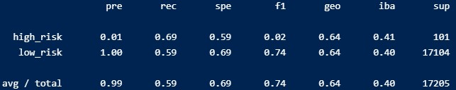
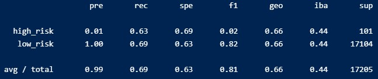
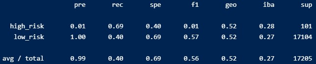
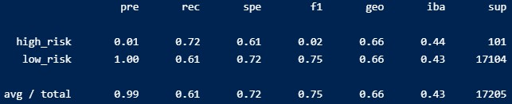
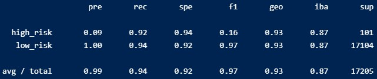

# Credit_Risk_Analysis
## Overview:
The purpose of this project was to look over the given data on loans and their acceptance or rejection status.  After looking through the data, various supervised machine learning techniques would be applied to discern whether or not a good model could be created that could accurately predict whether or not to approve a person for a loan using the provided criteria.  Afterwards, a brief analysis of each of the different techniques was done.

## Results:

### Naive Random Oversampling:
#### High Risk:
* Precision: 1%
* Recall: 69%
* Specificity: 59%
* F1: 2%

#### Low Risk:
* Precision: 100%
* Recall: 59%
* Specificity: 69%
* F1: 74%

#### Summary Image:

### SMOTE Oversampling:
#### High Risk:
* Precision: 1%
* Recall: 63%
* Specificity: 69%
* F1: 2%

#### Low Risk:
* Precision: 100%
* Recall: 69%
* Specificity: 63%
* F1: 82%

#### Summary Image:

### Cluster Centroids Undersampling:
#### High Risk:
* Precision: 1%
* Recall: 69%
* Specificity: 40%
* F1: 1%

#### Low Risk:
* Precision: 100%
* Recall: 40%
* Specificity: 69%
* F1: 57%

#### Summary Image:

### SMOTEENN Over/Under sampling:
#### High Risk:
* Precision: 1%
* Recall: 72%
* Specificity: 61%
* F1: 2%

#### Low Risk:
* Precision: 100%
* Recall: 61%
* Specificity: 72%
* F1: 75%

#### Summary Image:

### Balanced Random Forest Classifier:
#### High Risk:
* Precision: 3%
* Recall: 61%
* Specificity: 89%
* F1: 6%

#### Low Risk:
* Precision: 100%
* Recall: 89%
* Specificity: 61%
* F1: 94%

#### Summary Image:

### Easy Ensemble AdaBoost Classifier:
#### High Risk:
* Precision: 9%
* Recall: 92%
* Specificity: 94%
* F1: 16%

#### Low Risk:
* Precision: 100%
* Recall: 94%
* Specificity: 92%
* F1: 97%

#### Summary Image:

## Summary
My reccommendation would be to not use any of these models.  My reasoning is that the precision is very low for the high risk category in each of the models.  The best performance was from the Easy Ensemble AdaBoost Classifier which still only had a precision of 9%.  I believe that for a bank issuing loans correctly identifying defaulters would be the highest priority.  So for that reason, I cannot recommend any of these models be used.
